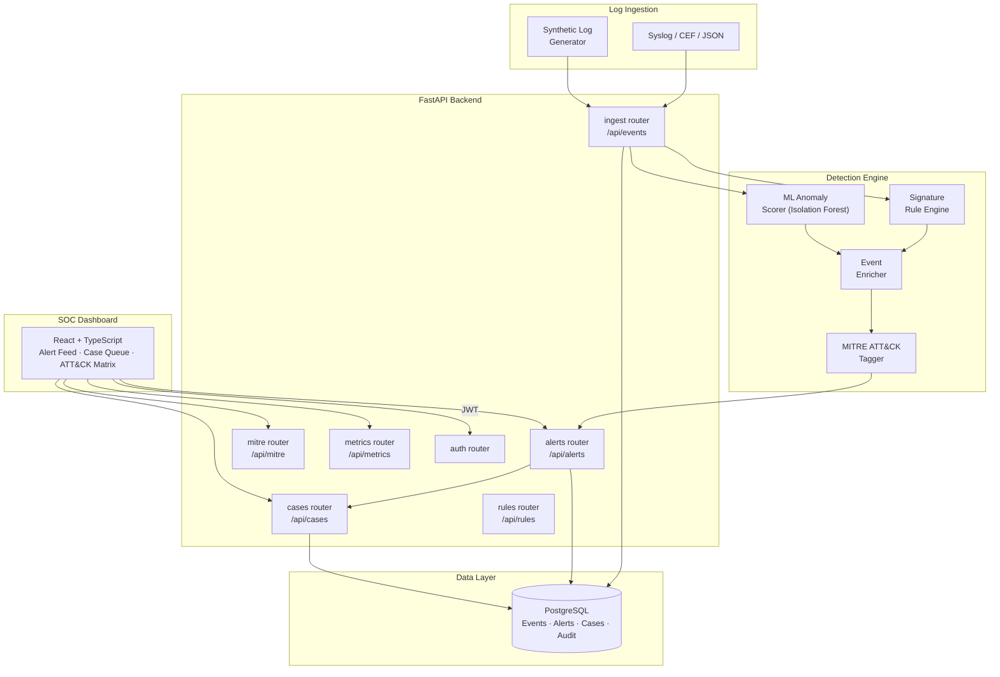

# Mercury

**SOC Threat Detection & Security Operations Platform**

[**🔗 View Live Preview →**](https://www.perplexity.ai/computer/a/mercury-preview-project-5-of-9-lCA5DWRgQoa4AN6VYPXAUQ)

> A production-style Security Operations Center (SOC) threat detection platform that ingests security logs, scores events with a multi-stage ML pipeline, maps findings to MITRE ATT&CK, and surfaces threats in a live analyst dashboard.

---

## 🎯 What I Built & Why

SOC analysts are drowning in alerts. I built Mercury to practice the full threat detection lifecycle — from raw log ingestion to enriched, prioritized threat cases — with a focus on the two biggest pain points: noise reduction and context enrichment.

- **Multi-stage detection** — rule-based fast-path for known signatures combined with ML anomaly scoring for novel threats, minimizing both false positives and missed detections
- **MITRE ATT&CK mapping** — every detected threat is tagged with technique and tactic IDs, giving analysts immediate context for prioritization and escalation
- **Case management workflow** — alerts are grouped into cases with status lifecycle (new → investigating → resolved), analyst notes, and escalation tracking
- **Synthetic log generation** — realistic event streams (lateral movement, privilege escalation, C2 beaconing, data exfil) for fully reproducible demos

---

## 🏗️ Architecture



---

## 📷 Features

- **Multi-stage detection** — signature rules + Isolation Forest ML anomaly scoring
- **MITRE ATT&CK mapping** — technique and tactic tagging on every detected threat
- **Case management** — alert grouping, status workflow, analyst notes, escalation tracking
- **Synthetic log generation** — lateral movement, privilege escalation, C2 beaconing, data exfil scenarios
- **Live SOC dashboard** — alert feed, case queue, and ATT&CK matrix heatmap
- **RBAC** — SOC Analyst, Tier 2 Investigator, and Admin roles
- **Docker Compose** — one-command local stack

---

## 🛠️ Tech Stack

| Layer | Technology |
|---|---|
| Backend API | FastAPI + SQLAlchemy + PostgreSQL |
| ML / Detection | scikit-learn (Isolation Forest) + rule engine |
| Threat Intel | MITRE ATT&CK framework mapping |
| Frontend | React + Vite + TypeScript |
| Infra | Docker Compose + GitHub Actions CI |

---

## 🚀 Quick Start

```bash
docker compose up --build
# Backend API docs: http://localhost:8000/docs
# Frontend:         http://localhost:5173
```

### Local Development
```bash
cd backend && pip install -e .[dev]
uvicorn app.main:app --reload

cd frontend && npm ci && npm run dev
```

### Quality Checks
```bash
make lint && make test
```

---

## 🗂️ Repository Structure

```
backend/    FastAPI API, detection engine, MITRE mapping, case management, tests
frontend/   React SOC dashboard
docs/       Architecture, demo runbook, API reference
```

---

## 📝 Key Learnings

- Combining rule-based signatures with ML anomaly detection reduces alert fatigue while maintaining coverage for novel threats
- MITRE ATT&CK mapping transforms raw detections into analyst-readable context — the difference between "anomaly detected" and "lateral movement via T1021"
- Case management is the bridge between detection and resolution; without it, alerts just pile up

---

## 📄 License

MIT
