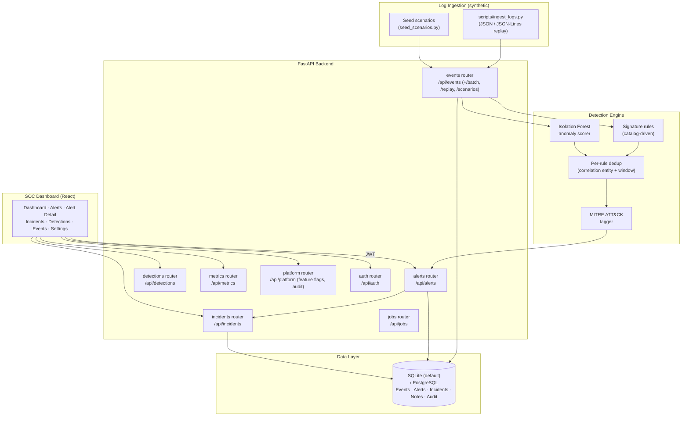

# Mercury

**SOC Threat Detection & Security Operations Portfolio Platform**

[**🔗 UI / Portfolio Design Preview →**](https://www.perplexity.ai/computer/a/mercury-preview-project-5-of-9-lCA5DWRgQoa4AN6VYPXAUQ)

> A portfolio-grade Security Operations Center (SOC) threat-detection platform that ingests **synthetic** security logs, scores them with a hybrid rule + Isolation-Forest detection engine, maps findings to **MITRE ATT&CK** technique IDs, and surfaces alerts and incidents in a React analyst dashboard. **Not a deployed SIEM; intended as an interview-ready demonstration.**

---

## 🎬 Recruiter Demo in 2 Minutes

```bash
# 1. Clone & start the full stack (FastAPI + Postgres + React)
git clone https://github.com/RyanJBush/SOC-threat-detection-platform.git
cd SOC-threat-detection-platform
docker compose up --build

# 2. Open the dashboard and log in
#    URL:      http://localhost:5173
#    Username: analyst   Password: analyst123   (admin/admin123 for full access)

# 3. In another terminal, replay a synthetic brute-force scenario
TOKEN=$(curl -s -X POST http://localhost:8000/api/auth/login \
  -H "Content-Type: application/json" \
  -d '{"username":"admin","password":"admin123"}' | python -c "import sys,json;print(json.load(sys.stdin)['access_token'])")

python scripts/ingest_logs.py data/brute_force_scenario.json --token "$TOKEN"

# 4. Watch alerts populate at http://localhost:5173/alerts
#    Open one to see MITRE technique tags, evidence events, AI summary, and analyst notes.
```

Full walkthrough: [`docs/DEMO_RUNBOOK.md`](docs/DEMO_RUNBOOK.md).
Backend Swagger UI: <http://localhost:8000/docs>.

---

## 📊 Project / Technical Snapshot

| Dimension | Detail |
|---|---|
| Project type | Portfolio / interview demonstration |
| Domain | Security Operations Center (SOC) threat detection |
| Backend | Python 3.11+, FastAPI, SQLAlchemy 2, Pydantic |
| Detection engine | 8 rule + anomaly detections in `detection_catalog.py`; scikit-learn `IsolationForest` for anomaly scoring |
| Threat-intel framework | MITRE ATT&CK technique & tactic tagging on every detection |
| Frontend | React 19 + Vite (JSX), Tailwind CSS, Recharts |
| Database | SQLite by default (local); PostgreSQL 16 via Docker Compose |
| Auth | JWT (HS256) with RBAC roles: `admin`, `analyst`, `deteng`, `viewer` |
| Backend routers | `auth`, `events`, `alerts`, `detections`, `incidents`, `jobs`, `metrics`, `platform`, `health` |
| Tests | 63 pytest test functions across 8 test modules (`backend/tests/`) |
| CI | GitHub Actions: ruff lint, bandit security scan, mypy, pytest, frontend lint + build |
| Sample data | `data/sample_auth_logs.json`, `sample_network_logs.json`, `sample_endpoint_logs.json`, `brute_force_scenario.json` (synthetic only) |
| Logs ingested | Synthetic JSON events (auth, network, endpoint) — no real enterprise telemetry |
| Lines of detection logic | `backend/app/services/detection_service.py` plus catalog |
| License | MIT |

---

## 🎯 What This Project Demonstrates

- **End-to-end SOC workflow design** — log ingestion → detection → alert → incident → analyst feedback, with each stage modelled in the schema and exposed over REST.
- **Hybrid detection thinking** — combining deterministic signature rules (brute force, privilege escalation, threat-intel match) with an unsupervised Isolation Forest anomaly scorer for unusual login hours / failure spikes.
- **MITRE ATT&CK mapping discipline** — every detection in `detection_catalog.py` is tagged with technique IDs (T1110, T1078, T1098, T1071, T1498, T1583) and tactics, so alerts inherit framework context for analyst triage.
- **Case-management modelling** — `incidents` router groups related alerts, tracks status transitions, holds analyst notes, and offers an AI wrap-up endpoint.
- **Operational ergonomics** — JWT auth, RBAC across four roles, audit logging, feature-flag toggles, deferred batch processing, dedup windows per rule, and per-alert investigation notes.
- **Production-style scaffolding** — Dockerfile per service, Compose stack, GitHub Actions CI, linting, security scanning, and pytest coverage.

> Mercury is engineered to look and feel like a real SOC tool, but it is a portfolio project running against synthetic data. It is not a substitute for production SIEM/SOAR platforms (Splunk, Sentinel, Chronicle, etc.).

---

## 🏗️ Architecture



Detailed write-up: [`docs/ARCHITECTURE.md`](docs/ARCHITECTURE.md).

---

## 📷 Screenshots / Demo

Place captures in [`docs/screenshots/`](docs/screenshots/README.md). Recommended set:

| Screen | What it shows | Where it lives |
|---|---|---|
| `01-alerts-feed.png` | Alert feed with severity + MITRE tags | `/alerts` |
| `02-incident-queue.png` | Incident (case) queue with status workflow | `/incidents` |
| `03-mitre-coverage.png` | MITRE ATT&CK technique coverage view | `/detections` (catalog) |
| `04-metrics-dashboard.png` | KPI + correlation hotspot dashboard | `/dashboard` |
| `05-api-docs.png` | FastAPI Swagger interactive docs | `http://localhost:8000/docs` |

See [`docs/screenshots/README.md`](docs/screenshots/README.md) for capture guidance.

---

## ✨ Key Technical Highlights

- **Catalog-driven detection engine** (`backend/app/services/detection_catalog.py`) — each detection is a frozen dataclass with severity, default confidence, MITRE techniques/tactics, recommendation, and a per-rule dedup window.
- **Hybrid scoring** — rule-based signals and an `IsolationForest` anomaly scorer share a single `DetectionSignal` schema, so downstream code is method-agnostic.
- **Correlation + dedup** — each signal carries a `correlation_entity` (IP, username) and `dedup_window_minutes`, so repeat firings collapse onto the same alert rather than spam the queue.
- **Synchronous & deferred ingestion** — `POST /api/events` scores inline; `POST /api/events/batch` accepts a `defer_detection` flag and processes through `/api/jobs/process-pending` for back-pressure demos.
- **Investigation lifecycle** — alert status (`open → investigating → resolved / false_positive`), analyst assignment, per-alert notes, timeline, and analyst true/false-positive feedback.
- **Incidents (cases)** — `POST /api/incidents` and `POST /api/incidents/{id}/alerts` cluster alerts into a managed case with status, timeline, and AI wrap-up.
- **Metrics surface** — `/api/metrics/summary`, `/kpis`, `/detection-quality`, `/scenario-benchmarks`, `/correlation-hotspots` drive the React dashboard.
- **RBAC & audit** — JWT auth, four roles, and an audit-log endpoint backing the platform router.
- **Observability** — structured request tracing middleware (`backend/app/observability.py`) injects request IDs into log records.
- **CI** — ruff + bandit + mypy + pytest in `.github/workflows/ci.yml`, plus a separate frontend lint/build job.

---

## 🛠️ Tech Stack

| Layer | Technology |
|---|---|
| Backend API | FastAPI 0.116, SQLAlchemy 2, Pydantic v2 |
| ML / Detection | scikit-learn 1.7 `IsolationForest`, pandas 2 |
| Threat-intel mapping | MITRE ATT&CK (techniques + tactics) |
| Frontend | React 19 + Vite (JSX), Tailwind CSS 4, Recharts |
| Database | SQLite (default), PostgreSQL 16 in Docker Compose |
| Auth | JWT (HS256), `passlib[bcrypt]`, `python-jose` |
| Infra | Docker + docker compose, GitHub Actions CI |
| Quality | ruff, bandit, mypy, pytest, ESLint, Prettier |

---

## 🚀 How to Run Locally

### Option A — Docker Compose (recommended)

```bash
docker compose up --build
# Backend Swagger: http://localhost:8000/docs
# Frontend:        http://localhost:5173
```

This launches Postgres, the FastAPI backend (with seeded demo users), and the Vite dev server.

### Option B — Native (backend SQLite, frontend Vite)

```bash
# Backend
cd backend
python -m pip install -r requirements.txt
uvicorn app.main:app --reload --host 0.0.0.0 --port 8000

# Frontend (separate shell)
cd frontend
npm ci
npm run dev
```

The backend falls back to `sqlite:///./vanguard_ai.db` when `VANGUARD_DATABASE_URL` is unset (see `.env.example`).

### Demo credentials (seeded on startup)

| Username | Password | Role |
|---|---|---|
| `admin` | `admin123` | Admin (full access) |
| `analyst` | `analyst123` | SOC Analyst |
| `deteng` | `deteng123` | Detection Engineer |
| `viewer` | `viewer123` | Read-only |

### Quality checks

```bash
make lint    # ruff + eslint
make test    # pytest
```

---

## 🧪 Demo Workflow — Replay Synthetic Logs and View Generated Alerts

```bash
# 1. Boot the stack
docker compose up --build

# 2. Get a token
TOKEN=$(curl -s -X POST http://localhost:8000/api/auth/login \
  -H "Content-Type: application/json" \
  -d '{"username":"admin","password":"admin123"}' \
  | python -c "import sys,json;print(json.load(sys.stdin)['access_token'])")

# 3. Replay a synthetic scenario through the ingestion API
python scripts/ingest_logs.py data/brute_force_scenario.json --token "$TOKEN"
# → POSTs in 50-event batches to /api/events/batch
# → Each batch prints { accepted, alerts_generated }

# 4. Inspect generated alerts
curl -s -H "Authorization: Bearer $TOKEN" \
  "http://localhost:8000/api/alerts?status=open" | python -m json.tool

# 5. Or open the dashboard
#    http://localhost:5173/alerts  → alert feed, severity, MITRE tags
#    http://localhost:5173/incidents → group alerts into incidents
```

Other replayable inputs in `data/`: `sample_auth_logs.json`, `sample_network_logs.json`, `sample_endpoint_logs.json`. Built-in scenarios can also be seeded via `POST /api/events/scenarios/{key}/seed` (see [`docs/DEMO_RUNBOOK.md`](docs/DEMO_RUNBOOK.md)).

---

## 🗂️ Repository Structure

```
backend/   FastAPI app — routers, detection services, models, schemas, tests
frontend/  React + Vite SOC dashboard (JSX, Tailwind, Recharts)
data/      Synthetic security logs and scenario fixtures
scripts/   ingest_logs.py — CLI replay tool for the events API
docs/      Architecture, API reference, MITRE mapping, demo runbook, resume bullets
.github/   CI workflow, issue & PR templates
```

---

## 🚧 Limitations & Future Work

| Area | Current state | Why it's a limitation | Planned direction |
|---|---|---|---|
| Data source | Synthetic JSON only (`data/*.json` + seed scenarios) | Cannot demonstrate behaviour against real enterprise telemetry | Public datasets (e.g., MITRE CALDERA, HELK), tap into a lab Zeek/Sysmon stream |
| Threat intel | IOC matches are simulated via event metadata | No live indicator feed | MISP / AlienVault OTX integration |
| Ingestion model | HTTP-only batch and single-event endpoints | Not a streaming pipeline | Kafka / Redis Streams consumer |
| ML model | Single `IsolationForest`, fit per-call on recent events | Not a deployed/maintained model lifecycle | Offline training, model registry, drift monitoring |
| Multi-tenancy | Schema has org IDs; isolation not hardened | Not safe for multi-customer use | Row-level auth checks, tenant-scoped tokens |
| MITRE coverage | 8 detections across ~6 techniques | Narrow vs. full ATT&CK surface | Add T1059, T1486, T1567 (see `docs/MITRE_MAPPING.md`) |
| Frontend visuals | Per-alert MITRE tags + Recharts KPI views | No full ATT&CK matrix heatmap UI yet | Build technique × tactic grid view |
| Production hardening | Demo JWT secret, no rate-limiting, debug seed on boot | Not production-ready | Secret management, rate limits, opt-in seeding |

**Scope honesty:** Mercury is a portfolio project, not a production SOC tool or deployed SIEM. All telemetry is synthetic.

---

## 📝 Resume Bullets (ATS-friendly)

Pick 2–4 depending on the role. See [`docs/resume-bullets.md`](docs/resume-bullets.md) for the full set with interview talking points.

- Built **Mercury**, a Python/FastAPI SOC threat-detection portfolio platform that ingests synthetic security logs, runs a hybrid rule + Isolation-Forest detection engine, and maps alerts to **MITRE ATT&CK** techniques.
- Designed an 8-detection catalog (signature rules + anomaly scorers) covering brute force (T1110), privilege escalation (T1098), impossible-travel logins, C2 indicators (T1071), and request-volume spikes (T1498) over synthetic auth/network/endpoint event streams.
- Modelled the full SOC workflow in the schema: event → detection → alert (with dedup window & correlation entity) → incident → analyst note → true/false-positive feedback, exposed through 9 FastAPI routers.
- Shipped a **React 19 + Vite** SOC dashboard (Tailwind, Recharts) with login, alert feed, alert investigation, incident queue, detections catalog, and KPI/metrics views, backed by JWT-authenticated REST APIs.
- Implemented **RBAC** across four roles (admin, analyst, detection engineer, viewer), audit logging, and feature-flag toggles via a dedicated platform router.
- Authored **63 pytest tests** across 8 modules covering ingestion, detection engine, RBAC, services, and CLI; gated on **ruff + bandit + mypy + pytest** in GitHub Actions CI.
- Packaged the stack with **Docker Compose** (Postgres 16 + FastAPI + Vite) and a `scripts/ingest_logs.py` CLI that replays synthetic log batches through `/api/events/batch` for reproducible detection demos.
- Documented architecture, API contract, MITRE coverage, demo runbook, and limitations under `docs/` to support recruiter / interviewer review.

---

## 📌 Project Status

- **Stage:** Active portfolio project.
- **Stability:** Backend API surface is stable across the 9 routers listed above; minor schema iteration is ongoing.
- **CI:** GitHub Actions passes lint, security scan, and tests on every push and PR to `main`.
- **Roadmap:** See **Limitations & Future Work** table above; tracked further in `docs/AUDIT_AND_IMPLEMENTATION_PLAN.md`.
- **Not in scope:** Real customer telemetry, multi-tenant production hardening, streaming pipelines, model lifecycle automation.

---

## 🎓 For Recruiters

- One-line bullets and interview prep: [`docs/resume-bullets.md`](docs/resume-bullets.md)
- Architecture write-up: [`docs/ARCHITECTURE.md`](docs/ARCHITECTURE.md)
- Demo runbook: [`docs/DEMO_RUNBOOK.md`](docs/DEMO_RUNBOOK.md)
- API reference: [`docs/api.md`](docs/api.md)
- MITRE ATT&CK coverage: [`docs/MITRE_MAPPING.md`](docs/MITRE_MAPPING.md)
- Screenshots: [`docs/screenshots/README.md`](docs/screenshots/README.md)

Topics: `cybersecurity` · `soc` · `siem` · `mitre-attack` · `threat-detection` · `fastapi` · `python` · `security-monitoring` · `portfolio-project`

---

## 📄 License

MIT — see [`LICENSE`](LICENSE).
